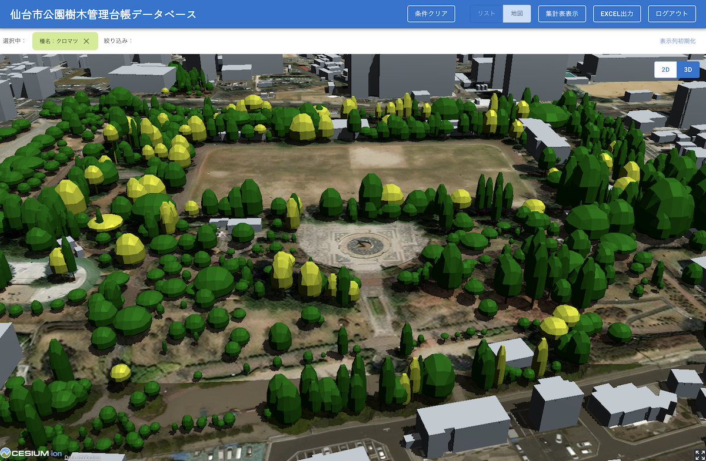

# 樹木管理台帳システム

 

## 1. 概要
本リポジトリでは、2023年度のProject PLATEAUで開発した「樹木管理台帳システム」のソースコードを公開しています。  
「樹木管理台帳システム」は、都市公園の樹木情報を樹木管理に活用するための台帳システムです。3D都市モデル（LOD2植生モデル）をデータベース管理することで、日常的な管理業務に活用するだけでなく、サードパーティのスマートフォンアプリ等と連携した市民協働型での樹木情報や写真の収集を可能としています。  
また、本システムは、周辺の建物モデルなどと合わせて樹木情報を2D/3Dで地図上に表示する機能を持ち、視覚的に樹木管理を行うことが可能です。

本システムはCARTO等の有償ライセンスを前提としたクラウドシステムです。

## 2.「樹木管理台帳システム」について

「樹木管理台帳システム」は、3D 都市モデル（植生モデル）を活用した樹木データベースシステムです。スマホアプリと連携することで、樹木の写真や情報をクラウドソーシング型で収集する仕組みを構築しています。  
また、クラウド環境で樹木情報の管理や集計を可能とし、管理業務の発注や CO2 吸収量算定等に活用可能です。  
これにより、台帳整備やデータ化に課題のあった公園樹木について、3D 都市モデル（植生モデル）のデータを用いることで標準的なデータベース化を可能とするとともに、体系的な樹木情報の管理を実現しています。  

本システムの詳細については[技術検証レポート](https://www.mlit.go.jp/plateau/file/libraries/doc/plateau_tech_doc_0084_ver01.pdf)を参照してください。

## 3. 利用手順
本システムの構築手順及び利用手順については[利用チュートリアル](https://r5-plateau-acn.github.io/SolarPotential/)を参照してください。

## 4. システム概要

#### ①2D/3D表示機能
- 公園内の樹木の3DTilesデータセットを地図上に表現します。
- 地図は2Dと3Dで切り替えて表示ができます。3D表示の際には樹種と樹高、枝張りに合わせて生成した樹木モデルが表示されます。

#### ②一覧表示機能
- 樹木の属性情報を一覧表示します。

#### ③検索機能
- 樹木の属性情報の一覧で列ごとに検索（文字型の場合は部分一致、数値型の場合は演算子を用いた指定）します。

#### ④集計機能　
- 樹木管理業務の発注に必要な樹種別の樹高階級ごとの本数を集計します。集計の際には、③検索機能による絞り込み結果を反映することができます。

#### ⑤データ更新機能　
- ②の一覧表示画面で、属性値の編集が行えます。

#### ⑥エクスポート機能
- ②の一覧、③の検索機能で抽出された結果、④の集計結果をそれぞれエクセル形式でエクスポートします。

## 5. 利用技術

| 種別              | 名称   | バージョン | 内容 |
| ----------------- | --------|-------------|-----------------------------|
| 商用ソフトウェア       | [FME Flow](https://safe.com/) | 2023.1 | FME Formで構築した処理フローをサーバーで実行する |
|        | [FME Form](https://safe.com/) | 2023.1 | ファイル変換などの処理およびその自動化を行う |
| 商用クラウドサービス  | [U-Green](https://greeninfrastructure.jp/u-green/) | - | 樹木の炭素吸収量などを配信するクラウドサービス |
|        | [Cesium ion](https://cesium.com/platform/cesium-ion/) | - | 3Dデータの変換と配信のクラウドサービス |
|        | [CARTO](https://carto.com/) | - | GISデータの可視化と配信のクラウドサービス |
|  商用ライブラリ   | [AG Grid](https://ag-grid.com/) | 31.1.1 | JavaScriptで集計、フィルタリング等を行うためのライブラリ |

## 6. 動作環境 <!-- 動作環境についての仕様を記載ください。 -->
| 項目               | 最小動作環境                                                                                                                                                                                                                                                                                                                                    | 推奨動作環境                   | 
| ------------------ | ----------------------------------------------------------------------------------------------------------------------------------------------------------------------------------------------------------------------------------------------------------------------------------------------------------------------------------------------- | ------------------------------ | 
| OS                 | Microsoft Windows 10 以上　または macOS 12 Monterey 以上                                                                                                                                                                                                                                                                                                                  |  同左 | 
| CPU                | Pentium 4 以上                                                                                                                                                                                                                                                                                                                               | 同左              | 
| メモリ             | 8GB以上                                                                                                                                                                                                                                                                                                                                         | 同左                        |                  | 

## 7. 本リポジトリのフォルダ構成 <!-- 本GitHub上のソースファイルの構成を記載ください。 -->
| フォルダ名               | 詳細               | 
| ------------- | ------------ | 
| auth | 認証State                                                                                                                                                                                                                                                                                                                  |  
| component  | 共有コンポーネント                                                                                                                                                                                                                                                                                                                           | 
| hooks  | ブラウザ機能共通コンポーネント                                                                                                                                                                                                                                                                                                                             | 
| manager  | データマネージャ                                                                                                                                                                                                                                                                                                                              | 
| resources/map  | geojson置き場                                                                                                                                                                                                                                                                                                                              | 
| App.css   | アプリ標準スタイル                                                                                                                                                                                                                                                                                                                              | 
| App.js  | アプリコンポーネント                                                                                                                                                                                                                                                                                                                              | 
| index.css  |  初期スタイル                                                                                                                                                                                                                                                                                                                             | 
| index.js  |  初期JS                                                                                                                                                                                                                                                                                                                             | 
| logo.svg  | ロゴファイル                                                                                                                                                                                                                                                                                                                              | 
| master_data.js  | リスト表示用パラメータ                                                                                                                                                                                                                                                                                                                              | 

## 8. ライセンス

- ソースコード及び関連ドキュメントの著作権は国土交通省に帰属します。
- 本ドキュメントは[Project PLATEAUのサイトポリシー](https://www.mlit.go.jp/plateau/site-policy/)（CCBY4.0及び政府標準利用規約2.0）に従い提供されています。

## 9. 注意事項

- 本リポジトリは参考資料として提供しているものです。動作保証は行っていません。
- 本リポジトリについては予告なく変更又は削除をする可能性があります。
- 本リポジトリの利用により生じた損失及び損害等について、国土交通省はいかなる責任も負わないものとします。

## 10. 参考資料
- 技術検証レポート: https://www.mlit.go.jp/plateau/file/libraries/doc/plateau_tech_doc_0084_ver01.pdf
- PLATEAU WebサイトのUse caseページ「樹木管理台帳システム」: https://www.mlit.go.jp/plateau/use-case/uc22-013/
⑫
