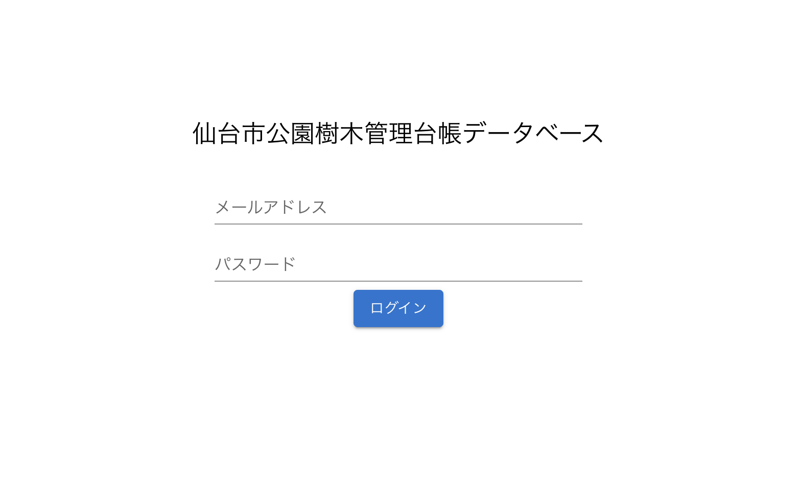
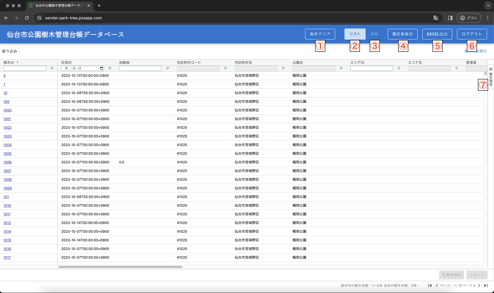
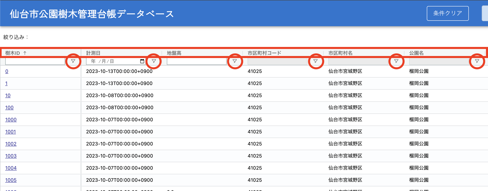
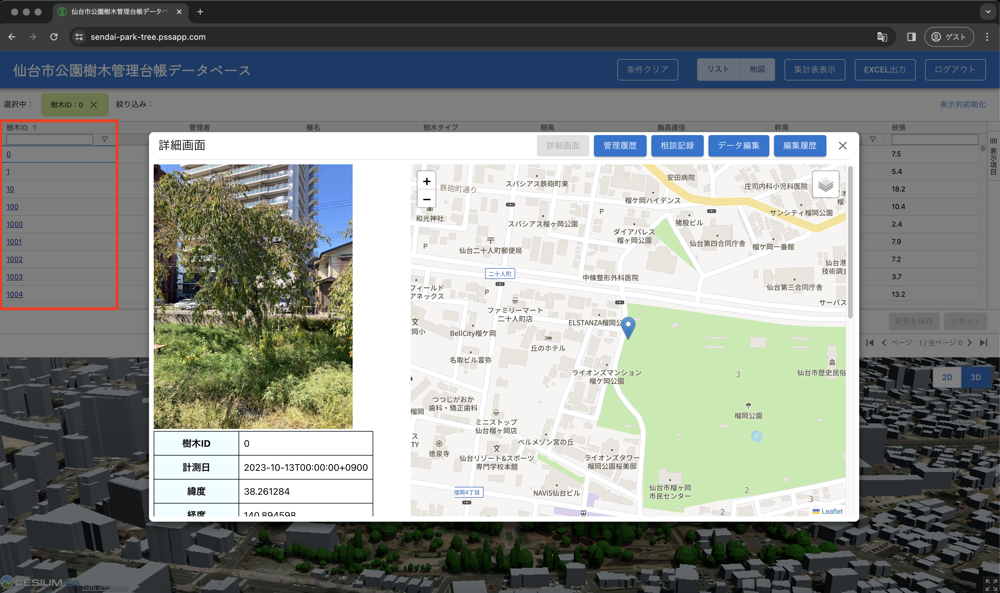
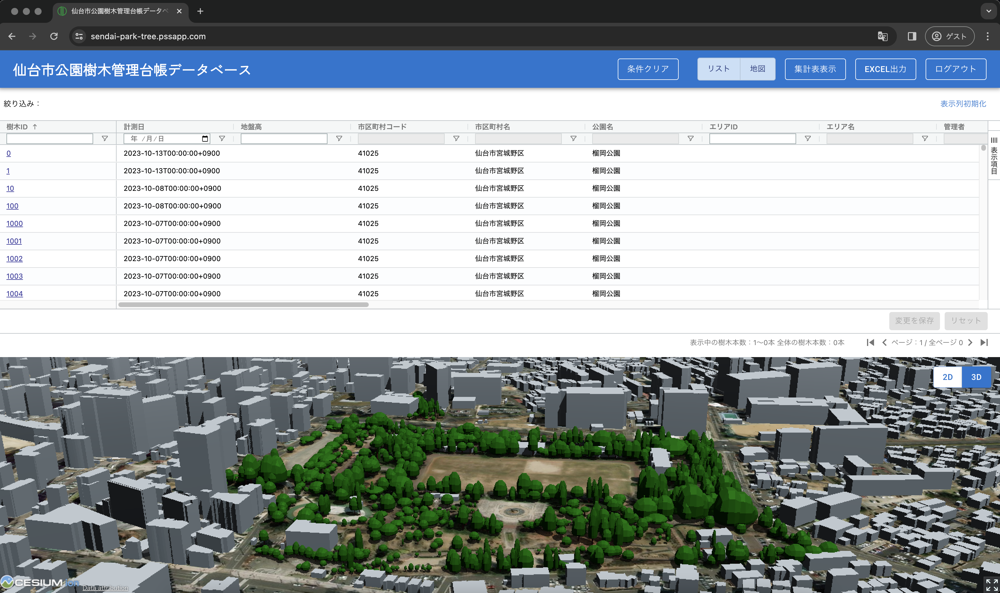
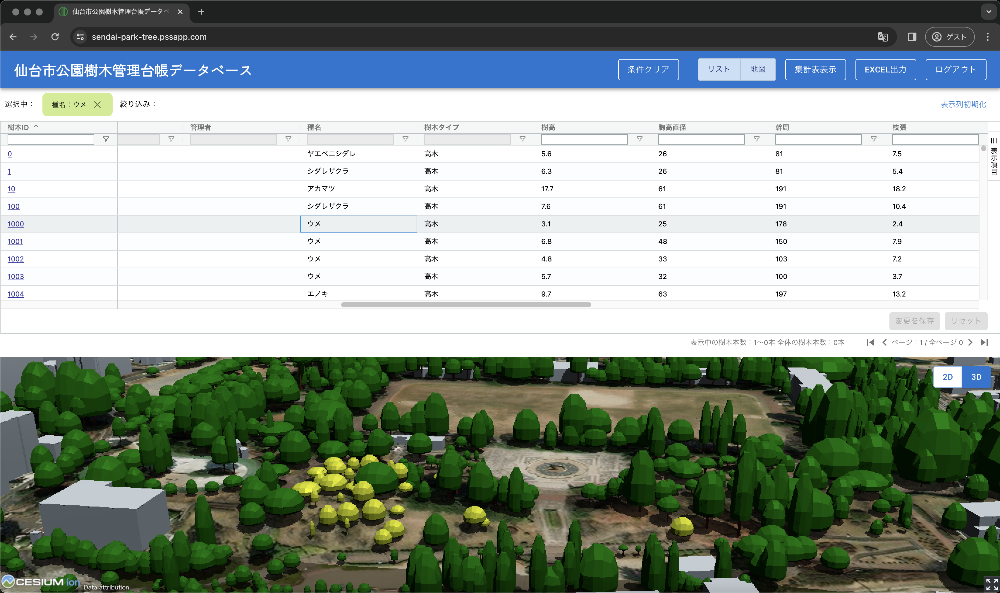
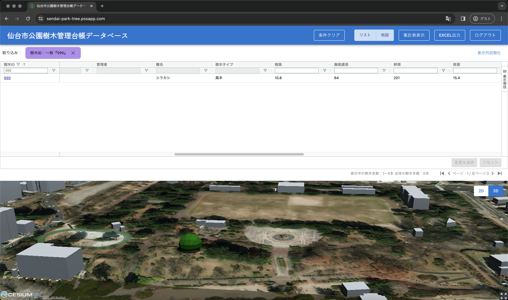
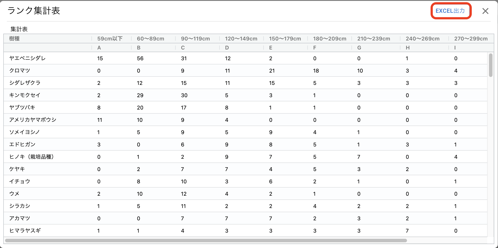

# 操作マニュアル

# 1 本書について

本書では、樹木管理台帳システム（以下「本システム」という。）の操作手順について記載しています。

# 2 使い方

## 2-1 ログイン画面

本システムをデプロイしたURLにアクセスすると以下の画面が表示されます。設定したログインID（メールアドレス）、パスワードを入力することでシステムのトップ画面が表示されます。

## 2-2 トップ画面

ログインすると以下の画面が表示されます。

① 条件クリア

　一覧で設定した絞り込み条件をリセットすることができます。

② リスト

　点検アプリで入力したインシデントを一覧表示することができます。また、登録された音声、画像を個表で、登録した位置を地図上で確認することができます。

③ 地図

　樹木の位置を2D/3Dで地図上に表現することができます。

④ 集計表表示

　樹木管理業務の発注に必要な樹種別の樹高階級ごとの本数を集計し、結果を表示することができます。

⑤ EXCEL出力

　②のリストをエクセルでエクスポートします。

⑥ ログアウト

　システムからログアウトします。

⑦ 表示項目

　②のリスト表示で画面上に表示する項目を選択できます。

## 2-2 一覧画面

① データの検索・絞り込み

・2-1②の一覧画面で、列名（図中赤四角）を押下すると、その列の値に従って昇順、降順の並べ替えが行えます。また、フィルタボタン（図中赤丸印）を押下して、「含む」などの条件を選択し、基準となる値を入力することでデータの絞り込みが行えます。また各列の先頭にある入力ボックスに検索したい数値や文字列を入力すると、該当するレコードの絞り込みが行えます。

② データのエクスポート

・2-1②の一覧表は検索や絞り込みの結果を反映した状態でエクセルファイルとして出力することができます。2-1⑤の「EXCEL出力」ボタンを押下することでデータのダウンロードが開始します。

③ 個表の表示

・2-1②の一覧表の「樹木ID」を押下すると、樹木の写真や詳細情報が閲覧できる個表がポップアップで表示されます。

## 2-3 地図画面

・2-1③の「地図」ボタンを押下すると一覧表の下に地図が表示されます。さらに、地図が表示されている状態で②の「リスト」ボタンを押下すると、地図が全画面で表示されます。再度「リスト」ボタンを押下すると、一覧と地図が画面の上下に表示される状態に戻り、さらに「地図」ボタンを押下すると、地図が非表示となり、一覧表示のみの初期状態に戻ります。

・地図画面の右上には2Dと3Dの表示を切り替えるボタンがあります。表示したい方のボタンを押下すると画面が切り替わります。

## 2-4 一覧・地図の連動

① 一覧→地図の連動

・一覧、地図を同時に表示した状態（②と③を両方押下した状態）では、一覧内のセルを押下すると（例えば「種名」が「ウメ」など）、地図画面は該当する属性を持つ樹木の色が反転して表示されます。

② 地図→一覧の連動
・一覧、地図を同時に表示した状態（②と③を両方押下した状態）では、地図内の樹木を選択すると（例えば樹木ID"999"）、一覧には押下した樹木に対応したレコードのみが表示されます。

## 2-5 集計表の表示・エクスポート

・2-1④の集計表表示ボタンを押下すると、検索や絞り込みの結果を反映した状態で樹種別、幹周の階級別の集計表が表示されます。この結果はエクセルファイルとして出力することができます。

